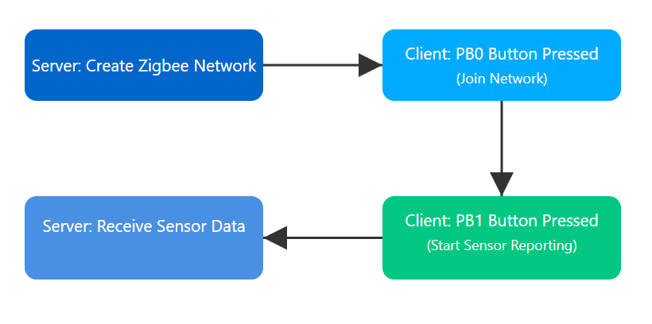

#  Wireless Sensor Network using Zigbee | EFR32MG12

This repository documents the creation of a **wireless sensor network** using **Zigbee protocol** on **EFR32MG12 boards** by Silicon Labs. The project demonstrates both **Centralized** and **Distributed architectures**, button-based interaction using On/Off commands, and **sensor data exchange through custom endpoints**.

The project is modular, divided into 3 detailed sections:
- [Forming and Joining the Network](./forming-and-joining.md)
- [Exchanging Sensor Data](./exchanging-sensor-data.md)
- [Turing and EFR32 into a Thread/Zigbee Sniffer](./turning-EFR32-as-sniffer.md)

---

##  Project Summary

This project demonstrates:

- Forming and joining a Zigbee network using both **Coordinator-Router** (Centralized) and **Router-Router** (Distributed) architectures.
- Sending **On/Off commands** via hardware buttons on EFR32MG12 boards.
- Creating and using **custom endpoints** for **sensor data exchange** between Zigbee nodes.

It highlights network commissioning, device communication, and custom attribute design using the Silicon Labs Zigbee stack.

---

##  Getting Started

###  Prerequisites

Ensure the following tools and hardware are ready:

| Requirement        | Version / Details                            |
|--------------------|-----------------------------------------------|
| **Gecko SDK**       | GSDK v4.4.0                                   |
| **Development IDE** | [Simplicity Studio](https://www.silabs.com/developers/simplicity-studio) |
| **Hardware**        | 2× EFR32MG12 Boards (1× Coordinator, 1× Router) |

---

##  Project Workflow

The implementation is structured into three primary phases:

1. **Forming and Joining the Network**  
   → Configure one node as the **Coordinator (Light)** and the other as the **Router (Switch)**.  
   → Devices join the network, security keys are managed, and communication is established.

2. **Exchanging Sensor Data**
   → Use **physical buttons** to transmit **Zigbee On/Off commands** from the Router to the Coordinator.
   → Design **custom endpoints** and **Zigbee attributes** for sensor data.  
   → Nodes share data dynamically over the Zigbee network.

 Click into each section for full documentation:

- [ Forming and Joining the Network](./forming-and-joining.md)
- [ Exchanging Sensor Data](./exchanging-sensor-data.md)

---

