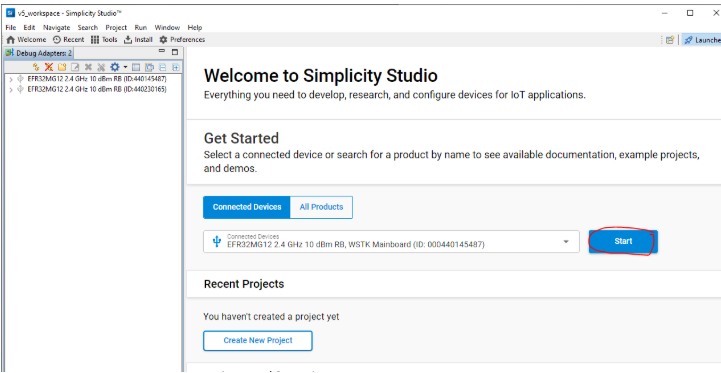
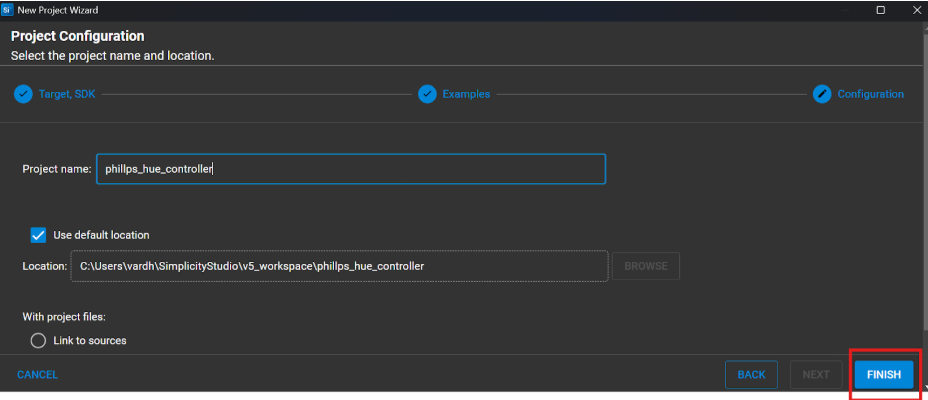
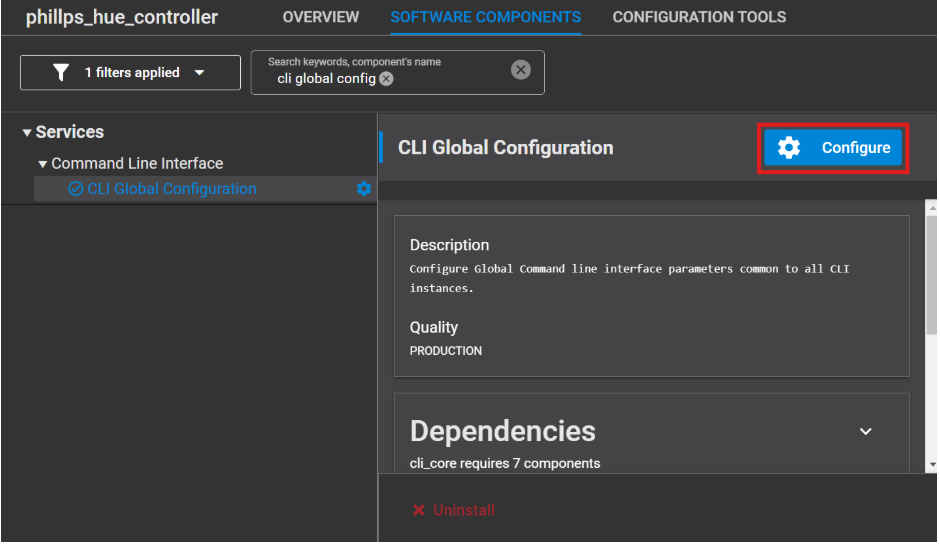
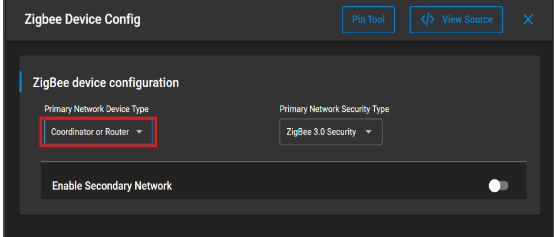
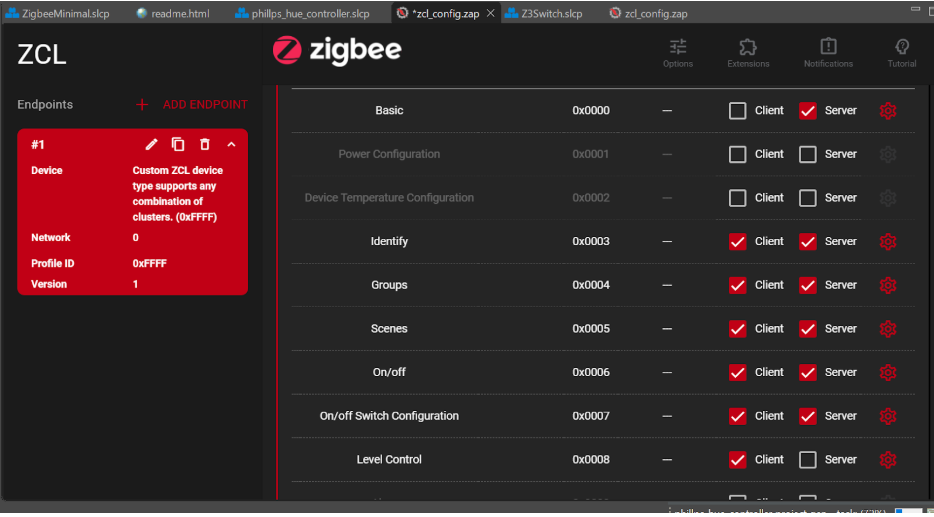
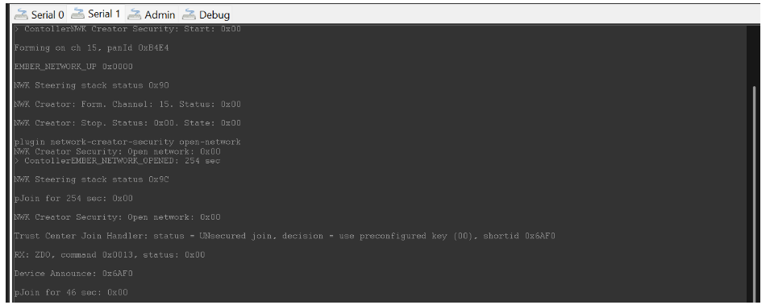
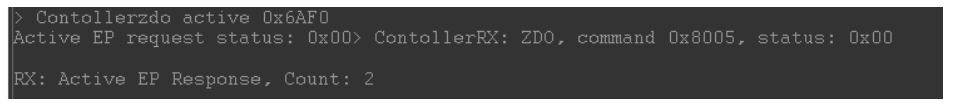

# Philips Hue Bulb Control using Silicon Labs EFR32MG Boards

This project demonstrates how to control a Philips Hue smart bulb using a custom Zigbee wireless network built on Silicon Labs EFR32MG boards. The goal is to create a Zigbee Coordinator that can form a network, allow third-party Zigbee devices like the Hue bulb to join, and control them using either serial commands or physical buttons on the board.

## 1. Creating the Zigbee Minimal Application

Open **Simplicity Studio**, navigate to the Welcome view, and click on **Start**.



### Creating a New Project

Create a new project using an existing minimal Zigbee example.




---

## 2. Configuring the Project as a Zigbee Controller

To control a Hue bulb, we need both Light (to create and open the network) and Switch (to send ZCL commands) functionalities in one application.

### Step 1: CLI Global Configuration

In the **Software Components**, enable the CLI and set the new prompt to `Controller`.



### Step 2: Install Necessary Components

Install the following software components:

- **Network Creator** and **Network Creator Security**
- **Zigbee Pro Stack** under Zigbee → Stack → Pro Core
- **Network Steering**
- **Update TC Link Key**
- **Simple Button**, and add two instances: `btn0` and `btn1`
- Configure the **Zigbee Device Configuration** as both **Coordinator** and **Router**



---

## 3. ZCL Advanced Platform (ZAP) Configuration

Open the ZAP tool and configure the Zigbee endpoints. Create a custom cluster to communicate with the Philips Hue light.


Save your changes and build the project. Flash the generated `.s37` file onto the device.

---

## 4. Controlling the Hue Bulb via Serial Console

1. After flashing, open the **Serial 1** console via the Debug Adapter.
2. Run the following commands to create and open the Zigbee network:
   `plugin network-creator start 1` and then
   
`plugin network-creator-security open-network`


4. If the Hue bulb was connected to another network, reset it:
- Download the **Philips Hue app**
- Scan the QR code on the bulb
- Pair the bulb with your phone via Bluetooth
- Follow the reset steps in the app

4. After resetting, wait a few seconds. You should see a new device join the network in the Serial 1 console – this is the Hue bulb.



5. Confirm the Hue bulb’s endpoints using the command: `zdo active <short_id>`


Example:`zdo active 0x6AF0`


The console should show "Count 2" if the endpoints are detected correctly.



6. Control the light using ZCL commands:

``zcl on-off on`` or 
``zcl on-off off``
and then 
``send 0x6AF0 1 0x0B``


---

## 5. Controlling the Hue Bulb via Buttons on the Board

An alternative approach is to use the onboard buttons to control the bulb.

### Steps:

1. Follow the same process to allow the Hue bulb to join the Zigbee network.

2. Clone the controller code from the GitHub repository.

   **Step 1:** Add the following variables to your code:

   ```c
   #define HUE_BULB_NODE_ID  0x6AF0
   #define HUE_BULB_ENDPOINT 11 


**Step 2: Replace the `sendMesssage` function with the below function.

```c
void sendMessage()
{
EmberStatus status;
if (button0Pressed)
  {
    emberAfFillCommandOnOffClusterOn();
    emberAfCorePrintln("Button0 is pressed");
        emberAfCorePrintln("Command is zcl on-off ON");
        emberAfSetCommandEndpoints(emberAfPrimaryEndpoint(), HUE_BULB_ENDPOINT);
        status = emberAfSendCommandUnicast(EMBER_OUTGOING_DIRECT, HUE_BULB_NODE_ID);
    status = emberAfSendCommandUnicast(EMBER_OUTGOING_DIRECT, 0x0000);
    if (status == EMBER_SUCCESS)
      {
        emberAfCorePrintln("Command is successfully sent");
      }
    else
      {
        emberAfCorePrintln("Failed to send");
        emberAfCorePrintln("Status code: 0x%x", status);
      }
    button0Pressed = false; // Resetting the Flag
  }
if (button1Pressed)
  {
    emberAfFillCommandOnOffClusterOff();
       emberAfCorePrintln("Button1 is pressed");
           emberAfCorePrintln("Command is zcl on-off Off");
           emberAfSetCommandEndpoints(emberAfPrimaryEndpoint(), HUE_BULB_ENDPOINT);
           status = emberAfSendCommandUnicast(EMBER_OUTGOING_DIRECT, HUE_BULB_NODE_ID);

    status = emberAfSendCommandUnicast(EMBER_OUTGOING_DIRECT, 0x0000);
    if (status == EMBER_SUCCESS)
      {
        emberAfCorePrintln("Command is successfully sent");
      }
    else
      {
        emberAfCorePrintln("Failed to send");
        emberAfCorePrintln("Status code: 0x%x", status);
      }
    button1Pressed = false; // Resetting the Flag
  }
}
````

3. Note the bulb’s short ID from the Serial 1 console.

4. Update the code where `HUE_BULB_NODE_ID` is defined with the new short ID.

5. Build and flash the project onto the board (without erasing).

6. The bulb can now be controlled using physical button presses.

## Summary

This project showcases how to integrate a commercially available Zigbee device like the Philips Hue bulb into a custom Zigbee network built on Silicon Labs EFR32MG boards. The process highlights skills in:

- Zigbee network creation and management
- Endpoint configuration with ZAP
- Embedded development using Simplicity Studio
- Interfacing with smart home devices
- Real-time control via UART and GPIO inputs

---
