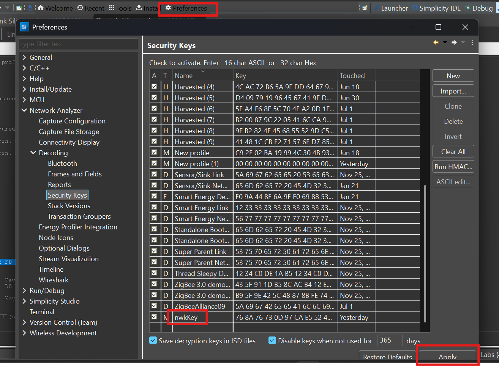

# EFR32 Sniffer Tool – Configuration Guide

## Overview

The **EFR32 Sniffer Tool** is designed to help developers and engineers monitor and analyze wireless communication traffic using EFR32-based boards. It transforms your development board into a sniffer device, allowing for real-time traffic inspection across supported wireless protocols such as **IEEE 802.15.4**, **Bluetooth Low Energy**, and **IEEE 802.15.4 Sub-GHz**.

This tool is particularly useful in:

- **Debugging communication issues** within wireless applications.
- **Validating packet structures** and protocol compliance.
- **Monitoring wireless environments** during development and testing phases.
- **Gaining visibility into over-the-air data**, which is essential for troubleshooting and optimization.

> ℹ️ This guide focuses on configuring the sniffer using the **Sniffer Configurator Tool**, which is the recommended and user-friendly method supported by the Simplicity Studio environment.

---

## Prerequisites

Before you begin, ensure you have the following:

- An **EFR32 development board**.
- The latest version of **Simplicity Studio** installed.
- The **Sniffer Configurator Tool** available via the Debug Adapter window.
- A valid **debug adapter** connected to your EFR32 board via USB.

---

## Step-by-Step Configuration Using the Sniffer Configurator Tool

### 1. Open the Sniffer Configurator

Navigate to the **Debug Adapters** view within Simplicity Studio.  
Right-click on the desired debug adapter and select **Sniffer Configurator**


---

### 2. Select the Target Debug Adapter

In the dialog that appears, choose the debug adapter that you want to turn into a sniffer. Click *Next*


---

### 3. Upload Sniffer Firmware (First-Time Only)

If this is your first time turning the board into a sniffer:

- Check the box for the appropriate debug adapter.
- Click *Select and upload sniffer to checked devices*
- Then click *Next*


---

### 4. Configure Sniffer Parameters

In the parameter configuration window:

- Choose your desired protocol from the dropdown menu:
  - `IEEE 802.15.4`
  - `Bluetooth Low Energy`
  - `IEEE 802.15.4 Sub-GHz`
- Adjust frequency, channel, and data rate settings as required for your environment.

After configuration, click **Apply EFR32 sniffer Configuration** and *Finish*.


---

## Verifying and Starting the Capture

## Verifying and Starting the Capture

### 5. Verify Sniffer Functionality with Zigbee Network

Now we will verify that the sniffer is functioning correctly by using two additional EFR32 boards to form a Zigbee network and observe the data being captured.

---

#### 1. Create a Zigbee Network on the Light Node

Start by setting up a Zigbee network on one of your boards configured as a **Zigbee Light** device.  
After the network is formed, note the **channel number** being used.


---

#### 2. Align Sniffer to the Same Channel

To ensure the sniffer listens on the same channel:

- Open **Launch Console** in Simplicity Studio.
- Navigate to **Serial 1** of the sniffer board.


Check if the sniffer is set to the same channel. If not, you can manually set the channel using the following command:

```bash
setChannel <desired_channel_number>
```
Replace <desired_channel_number> with the actual channel used by the Zigbee Light.

#### 3. Add the Switch Node to the Network
Now power up the board configured as a Zigbee Switch and allow it to join the network.
Return to the Network Analyzer and click **Start Capture**.

-You will now observe traffic flow in the capture window, including nodes communicating on the Zigbee network.

#### 4. Handle NWK Decryption Errors (Optional)
You may notice a NWK Decryption Failed error when viewing traffic.
-This occurs if the network security key is not yet known to the sniffer.

 
-To resolve this:

On the Zigbee Light device, execute the following command to print security keys:
```
keys print
```
- Copy the NWK Key from the output.

  

- Paste it into the appropriate section of the Network Analyzer to enable proper decryption.


## Conclusion

With the EFR32 board now functioning as a sniffer, you can efficiently monitor wireless activity in your system, gaining detailed insights critical for debugging and validation. This tool supports multiple protocols and offers a reliable, repeatable method for wireless traffic analysis in a professional development workflow.

For any additional configuration needs or troubleshooting, please refer to the full [Simplicity Studio Documentation](https://www.silabs.com/developers/simplicity-studio).


